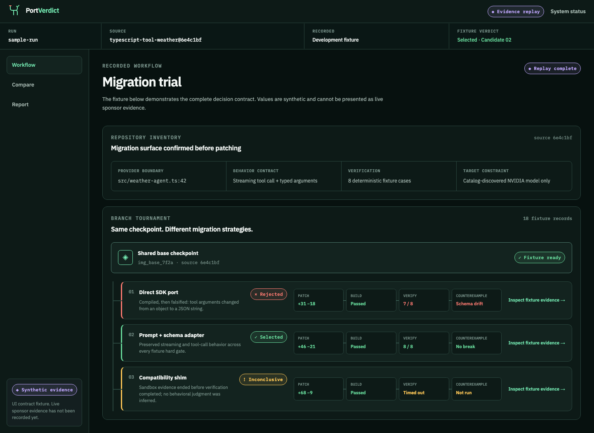

# PortVerdict

> The model migration agent that puts every candidate branch on trial.

[Live replay demo](https://portverdict.vercel.app) · [System status](https://portverdict.vercel.app/status) · [Architecture](docs/architecture/README.md) · [Evaluation](docs/evaluations/methodology.md) · [Security](SECURITY.md)

PortVerdict is an evidence-first coding agent for migrating AI applications to NVIDIA models on Nebius. Instead of trusting one plausible patch, it forks three migration strategies from one immutable Sandbox checkpoint, attacks each with executable compatibility checks, and selects a branch only when every hard gate has attributable evidence. If none qualifies, it abstains.



## Why it exists

A provider migration can compile while silently changing streaming, structured output, tool arguments, retries, or error semantics. Conventional code generation optimizes for a patch. PortVerdict optimizes for a defensible verdict:

1. Inventory the real provider boundary and behavior contract.
2. Discover an exact NVIDIA model ID from the authenticated Token Factory catalog.
3. Prepare dependencies once, checkpoint the isolated Nebius Sandbox, and fork three sibling strategies.
4. Build, test, replay contracts, validate schemas and tool calls, scan security, and ask a counterexample stage to falsify each candidate.
5. Reject behavioral failures, preserve infrastructure failures as inconclusive, and select only a fully eligible branch—or abstain.
6. Produce a provenance-linked report and guarded patch export without hiding losing branches.

## Judge path

The public deployment opens without an account. Choose **Run recorded sample**, then inspect the workflow, comparison, evidence, report, and guarded patch.

The hosted sample is deliberately labeled **synthetic development replay**. It demonstrates the complete decision contract but does not claim that Nebius, NVIDIA, Tavily, GitHub, or a hosted Sandbox was called. `/status` reports those integrations as unconfigured until authenticated live evidence exists.

## Architecture

```text
Browser / replay API
        │
        ▼
Next.js control plane
  ├── pure run reducer ─────────────> append-only evidence store
  ├── catalog-bound model router ───> Nebius Token Factory / NVIDIA model
  ├── official-source research ─────> Tavily search → filter → extract
  └── checkpoint tournament ────────> Token Factory Sandboxes
           ├── direct SDK port ───────────┐
           ├── prompt + schema adapter ───┼─> deterministic gates → select / abstain
           └── compatibility shim ────────┘
```

The browser renders validated snapshots; it never decides whether code is safe. The reducer owns state transitions, adapters own bounded side effects, the evidence store owns integrity and redaction, and the evaluator owns eligibility. Untrusted repository code is designed to execute only inside a non-root, network-disabled Sandbox branch—not on the web host.

## What is implemented

- Strict Zod schemas for runs, events, evidence, replay manifests, and HTTP contracts.
- Exhaustive, idempotent reducer with rejection, inconclusive, cancellation, retry, selection, and abstention semantics.
- Append-only evidence records, atomic snapshots, content hashes, traversal protection, redaction, and replay integrity checks.
- Provenance guard that rejects unsupported numeric claims and a gate-first deterministic evaluator.
- Runtime Token Factory catalog discovery, exact NVIDIA model binding, structured chat validation, bounded retries, and content-free telemetry.
- Sandbox operation, polling, SSE resume, cancellation, non-root execution, network policy, location validation, and shared-checkpoint invariants.
- Tavily search→exact-domain-filter→extract flow with bounded content, no redirects, retry budgets, usage capture, and untrusted-content treatment.
- Guest replay UI, accessible branch rail, comparison, evidence pages, report, resumable SSE API, and acknowledged unsafe patch export.
- Ten deterministic TypeScript/Python migration contract fixtures, security headers, threat model, CI, Vercel deployment, and a non-root standalone container.

## Repository map

```text
apps/web/                  Next.js guest experience and replay API
packages/agent-core/       Run state machine and reducer
packages/evaluator/        Hard gates, provenance, selection, abstention
packages/evidence-store/   Append-only artifacts, hashes, redaction
packages/model-router/     Token Factory catalog and chat adapter
packages/sandbox-runner/   Token Factory Sandbox adapter
packages/shared-schemas/   Cross-boundary Zod contracts
packages/tavily-research/  Official-source research adapter
fixtures/                  Ten deterministic migration probes + sample replay
docs/                      Architecture, evaluation, security, requirements
infra/                     Local Compose and Nebius-ready container boundary
submission/                Devpost draft, testing guide, media plan, screenshots
```

## Local development

Requirements: Node.js 24 and pnpm 11.19.0.

```bash
git clone https://github.com/dorakingx/portverdict.git
cd portverdict
cp .env.example .env.local
pnpm install --frozen-lockfile
pnpm dev
```

Open `http://localhost:3000`. Replay mode needs no credentials.

Live adapter credentials are server-side only:

- `NEBIUS_API_KEY` and `NEBIUS_AI_PROJECT` for Token Factory inference.
- `CONTREE_TOKEN` and `CONTREE_PROJECT` for Token Factory Sandboxes.
- `TAVILY_API_KEY` for runtime documentation research.

Variable presence alone does not enable public live runs. Authenticated catalog, inference, shared-checkpoint branching, and Tavily smoke evidence must pass first; anonymous live mode also needs distributed rate limiting and cleanup monitoring.

## Verification

```bash
pnpm verify
pnpm benchmark
pnpm test:e2e
pnpm secret:scan
pnpm audit --audit-level high
```

The local contract suite currently contains ten synthetic probes across chat, streaming, structured output, tool calling, and retry/timeout behavior in TypeScript and Python. Results are reproducible harness evidence—not sponsor-platform or model-quality claims. See [methodology](docs/evaluations/methodology.md) and [recorded results](docs/evaluations/results.md).

The production container can be checked with:

```bash
docker build -f infra/nebius/Dockerfile -t portverdict:local .
docker run --rm -p 3000:3000 --read-only \
  --tmpfs /tmp:rw,noexec,nosuid,size=64m portverdict:local
```

## Public API

| Endpoint                                                | Purpose                                                   |
| ------------------------------------------------------- | --------------------------------------------------------- |
| `GET /api/health`                                       | Process liveness without credential details               |
| `GET /api/ready`                                        | Redacted replay/live dependency readiness                 |
| `POST /api/runs`                                        | Validated replay launch; live fails closed until verified |
| `GET /api/runs/sample-run`                              | Immutable sample snapshot                                 |
| `GET /api/runs/sample-run/events`                       | Resumable SSE-formatted replay via `Last-Event-ID`        |
| `GET /api/runs/sample-run/report`                       | Watermarked synthetic Markdown report                     |
| `GET /api/runs/sample-run/patch?acknowledgeUnsafe=true` | Explicitly acknowledged synthetic patch                   |

## Security and evidence policy

- Secrets never enter browser bundles, model prompts, repository branches, or content-bearing telemetry.
- Repository URLs, provider origins, request sizes, output, retries, time, and candidate count are bounded.
- Retrieved documentation and model/repository output remain untrusted data; they cannot alter policy.
- Hard-gate failures cannot be overridden by a persuasive model rationale.
- Rejected and inconclusive candidates stay visible; incomplete evidence never becomes a winner.
- The replay patch is watermarked investigation-only and requires acknowledgement.

See the [threat model](docs/security/threat-model.md), [security policy](SECURITY.md), and [requirements traceability](docs/requirements-traceability.md).

## Hackathon status

The implementation, replay deployment, contract-tested sponsor adapters, container, local benchmark, and public verification path are complete. Final authenticated sponsor evidence remains intentionally blocked until credentials are supplied. The public YouTube demo and final Devpost submission must be recorded from that verified live run and still require the entrant's legal eligibility attestations.

PortVerdict targets **Coding and Agentic Engineering** and **Best Use of Tavily** in the Nebius x NVIDIA Global AI Hackathon.

## License

[Apache-2.0](LICENSE)
